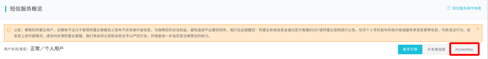
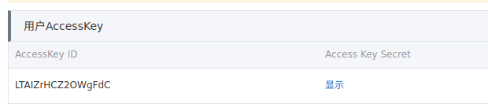
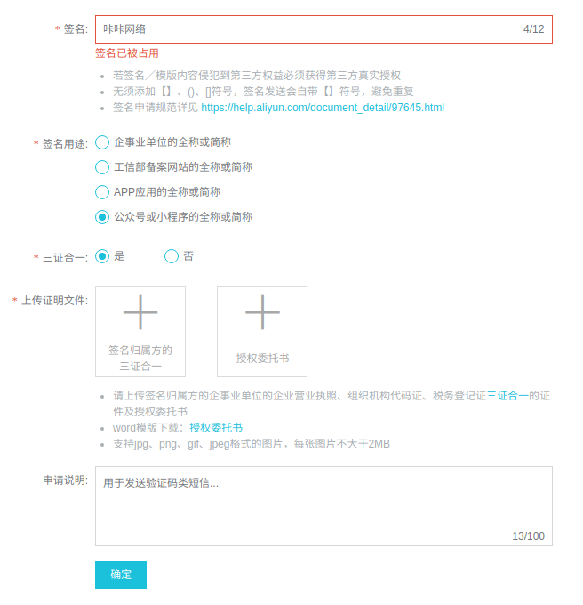
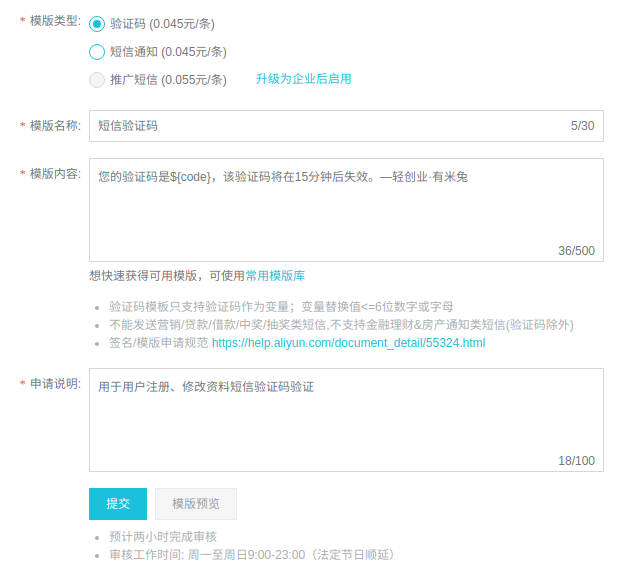

# 阿里云短信

1. 进入 `www.aliyun.com` 按步骤操作
    > 阿里云后台->产品与服务->云通信->短信服务

1. 如果没有剩余条目 则需要购买 [购买短信](https://common-buy.aliyun.com/?spm=5176.12207334.0.0.72d31cbeKzltAN&commodityCode=newdysmsbag#/buy) 

    酌情购买
1. `获取 AccessKey ID` 及 `Access Key Secret` 按步骤操作
    > 短信服务->概览->AccessKey 如下图
    
    
    
    点击
    
    
    复制备用
    
1. 创建签名 按步骤操作
    > 短信服务->国内消息->签名管理->添加签名 如图
    
    
    
    签名名称备用
1. 创建模板 按步骤操作
    > 短信服务->模板管理->添加模板 如图
    
    
    添加后 如图
    

    图中红色 `模板CODE` 备用
    
1. 数据汇总

    ```code
        AccessKey ID: 
        Access Key Secret:
        签名名称: 
        模板CODE:
    ```
    以上四个参数写入配置文件 `ymtOld/server/application/conf_stage.php` 及 `ymtOld/server/application/conf_prod.php` 的 `alisms` 下, 对应的参数替换

