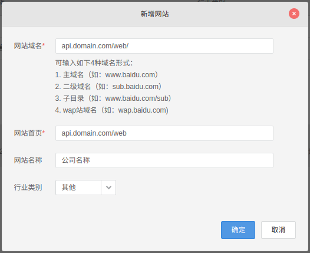
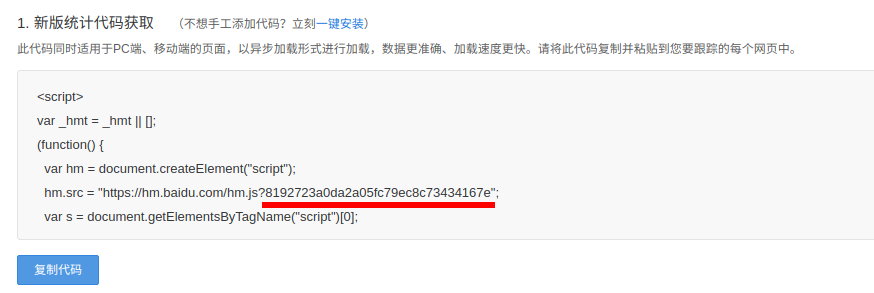
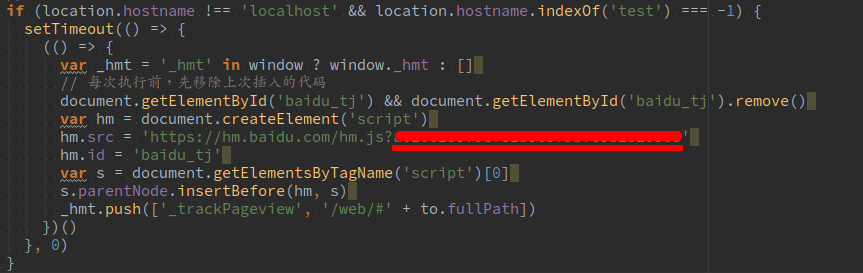

# 百度统计

### 申请百度统计账号

1. https://tongji.baidu.com/web/welcome/login
1. 如果是新建账号根据引导新增网站
1. 如果已有账号 根据以下步骤操作
   > 百度统计后台->管理->自由网站->新增网站
   
1. 参考表单

    
1. 点击确定后弹出以下内容

    
1. 复制上图中红色部分
1. 复制至文件 `ymtOld/web/src/router/index.js L:539` 替换, 如下图

    

