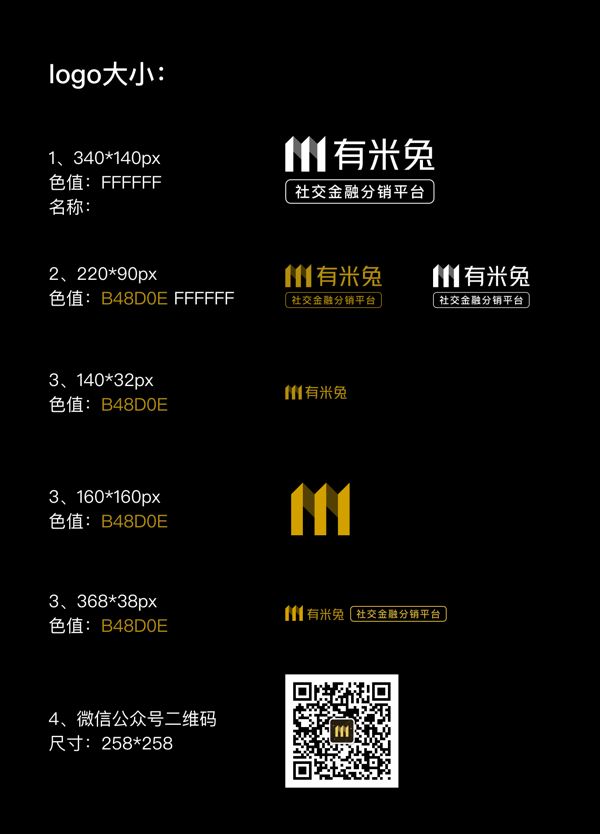

# 准备资料

### 文字类(可后期修改)

名称|参考值
---|---
平台名称|有米兔金服
平台昵称|有米兔
关注的微信公众号|有米兔金服
平台标语|轻创业·有米兔

### 图片类(需压缩)

### 服务器
前期建议双核8G

### 域名(需备案) 
需解析两个域名
1. 供API调用 eg: api.domain.com
2. 后台管理  eg: admin.domain.com

如果需要搭建测试环境 还需解析
1. 供API调用 eg: api.test.domain.com
2. 后台管理  eg: admin.test.domain.com

开通3306 6379端口 系统交付后可关闭
