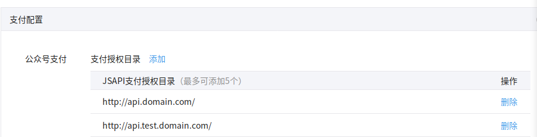
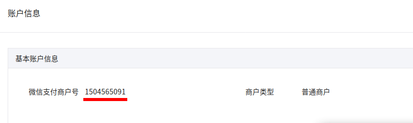
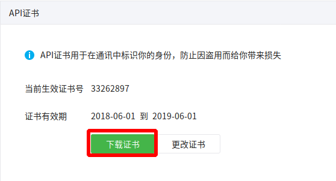
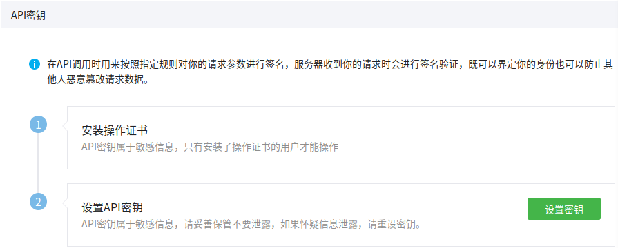

# 微信配置

### 微信商户平台 [链接](https://pay.weixin.qq.com)

1. 添加支付授权 操作如下
    > 微信商户平台->产品中心->开发配置->支付配置->公众号支付->添加支付授权目录
    
    添加授权: `http://api.test.domain.com/`, `http://api.domain.com/`
    如图:
    
    

1. 获取微信支付商户号 操作如下
    
    > 微信商户平台->账户中心->账户设置->基本账户信息->微信支付商户号
    
    如图:
    
    

1. 下载证书 操作如下
    > 微信商户平台->账户中心->账户设置->API安全->API证书->下载证书
    
    如图:
    
    

1. 设置API密钥 操作如下
    > 微信商户平台->账户中心->账户设置->API安全->API秘钥->设置API密钥
    
    如图:
    
    

### 数据汇总

写入配置文件

```code
    商户号: 
    API密钥:
```
将证书压缩包: `cert.zip` 解压至系统目录 `ymtOld/server/wechatPayCert`, `ymt/wechatPayCert`
