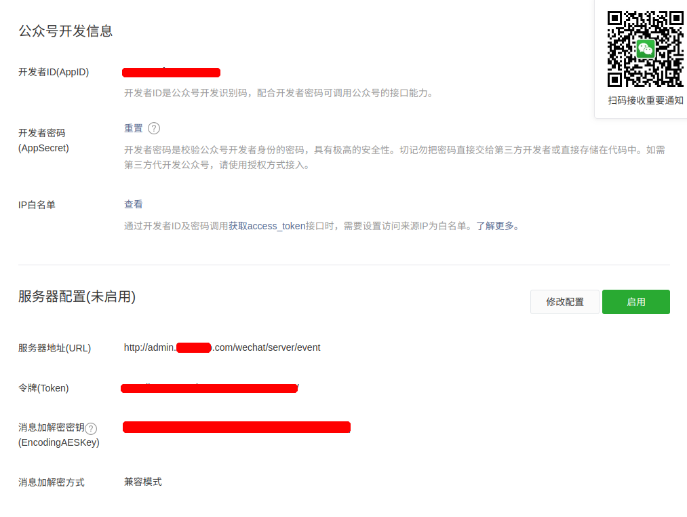

# 微信配置

### 微信公众平台 [链接](https://mp.weixin.qq.com)
1. 基本配置 操作如下
    > 后台->开发->基本配置

    
    
    注意: 
    1. 添加IP白名单: 添加对应服务器IP
    1. 服务器配置选择兼容模式

    数据汇总
    ```code
        开发者ID(AppID): 
        开发者密码(AppSecret):
        令牌(Token): 
        消息加解密密钥(EncodingAESKey):
    ```

1. 网页授权 操作如下
    > 后台->开发->接口权限->网页服务->网页授权->网页授权获取用户基本信息->点击修改
    
    设置业务域名
    
    
    
    将图中红线的文件下载 放至 `ymtOld/server/public` 目录下
    
    设置最终的效果如图
    
    

1. 微信推送模板 操作如下
    > 后台->功能->模板消息->我的模板
    
    系统一共6套模板 如图
    
    

    添加步骤: 
    1. 点击 `从模板库添加`
    1. 搜索上图中的 `标题`, 这里以 `服务状态提醒` 为例
        
        
    
    1. 参考模板
    
        
        
    1. 参考图片
    
        1. 
        
        1. 
        
        1. 
        
        1. 
        
        1. 
        
        1. 
